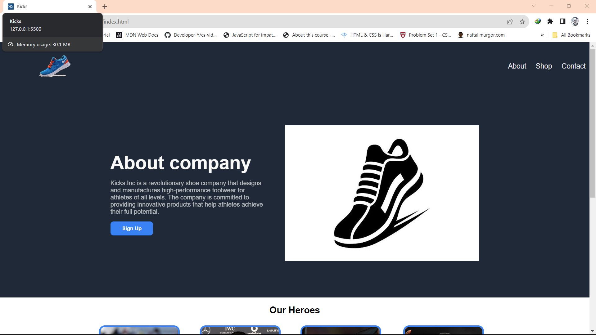
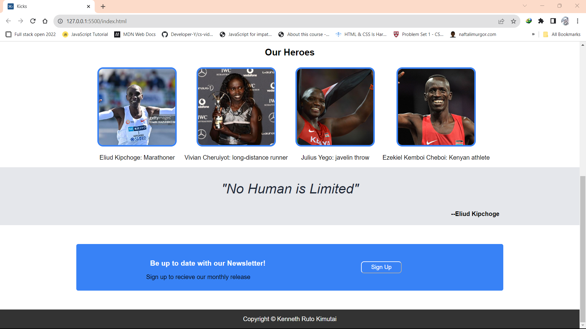

# The Tech Hut: Frontend One

First Frontend Task

# Description

The Kicks.Inc website would aim to provide a comprehensive and engaging online platform for customers to explore and purchase the company's high-performance footwear and casual wear. The website should effectively showcase the brand's identity, highlight product features, facilitate seamless navigation, and encourage customer interaction.

## Objectives

1. Brand Representation: This website should effectively represent the Kicks.Inc brand, conveying its core values of innovation, performance, and style. A cohesive design, consistent messaging, and high-quality visuals should create a memorable brand experience.

2. Product Showcase: This website should serve as a virtual showroom, providing customers with detailed information about Kicks.Inc products. Product descriptions, high-resolution images, and interactive features should enable customers to make informed purchasing decisions.

3. Seamless Navigation: This website should be designed for intuitive and user-friendly navigation, allowing customers to effortlessly find the products and information they seek. Clear menus, consistent layouts, and effective search functionalities should enhance the user experience.

4. Customer Engagement: This website should foster customer engagement through interactive features, such as product reviews, wish lists, and social media integration. These elements encourage customer interaction, build brand loyalty, and drive sales.

5. E-commerce Functionality: This website should provide a secure and convenient e-commerce platform for customers to purchase Kicks.Inc products. A streamlined checkout process, multiple payment options, and order tracking features should enhance the shopping experience.

# Design

